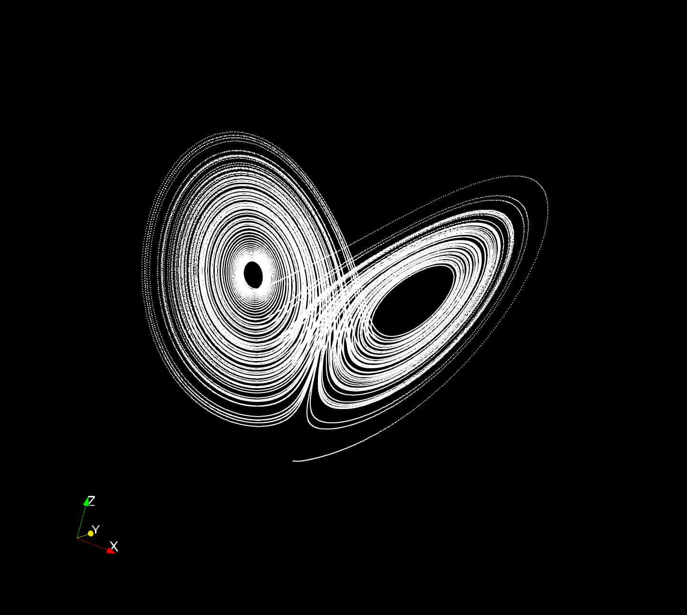

# Coupled-heat-transport
One-way coupled model of heat transport; proxy for turbulent convection (Lorenz model) coupled to 1D diffusion problem.

This code is intended as a simple proxy for coupling turbulent convective heat transport to a linear solid diffusion problem.  The turbulence proxy is the Lorenz model (note the physically-correct output is the Nusselt number, but the code currently uses one of the other outputs in order to generate a time series with a a greater degree of variability).  This output provides the input into a linear, time-dependent 1D diffusion problem (in a one-way coupling sense) as the Neumann condition on the left hand side i.e. it is a heat flux; the right-hand boundary condition is zero temperature and the QoI is the gradient of T at the output.

The Lorenz model has three inputs, rho, sigma, and beta, which represent the Rayleigh number, Prandtl number, and coupling parameter in the underlying model.  Varying these gives a `phase diagram' structure in which some values give `turbulent' states with no steady solution.

The diffusion model has a single parameter, the diffusion coefficient D (the interval width is fixed at unity).  

It can be seen that large values of diffusion coefficient allow the heat to cross the diffusive region largely unaffected, while shrinking this value both reduces the heat flux and smoothes out features in the time series.

 and outputs (orange) to the diffusive region as time series for various values of diffusion coefficient D.  Horizontal axis is time and vertical axis is temperature gradient.")

The parameters are controlled via the input.txt file, which contains the four numerical values for rho, sigma, and beta of the Lorenz model and the diffusion coefficient for the diffusion model.
